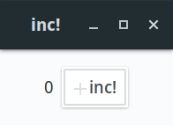

# vgtk

A declarative desktop UI framework for Rust built on [GTK](https://www.gtk.org/) and [Gtk-rs].

## At A Glance

-   A clean, functional component model inspired by the
    [Elm architecture](https://guide.elm-lang.org/architecture/), [Redux](https://redux.js.org/) and
    [Yew](https://github.com/yewstack/yew).
-   A declarative DSL for composing GTK widgets inspired by [React](https://reactjs.org/) and
    [JSX](https://reactjs.org/docs/introducing-jsx.html), using virtual "DOM" diffing for efficient
    updates.
-   Fully cross platform with a native look and feel for Linux, Windows and macOS.
-   Built on Rust's [`Future`](https://doc.rust-lang.org/std/future/trait.Future.html)s using
    [GLib](https://developer.gnome.org/glib/stable/)'s event loop, giving you
    [async/await superpowers](https://rust-lang.github.io/async-book/) cleanly integrated with the
    GTK event model.
-   Absolutely no need for an embedded browser engine, unless you
    [really want one](https://webkitgtk.org/).

## Documentation

-   [API docs (latest release)](http://vgtk.rs/)
-   [Tutorial](https://bodil.lol/vgtk/)

## Show Me!

<p align="center">
  
</p>

```rust
use vgtk::{ext::*, gtk, run, Component, UpdateAction, VNode};
use vgtk::lib::{gtk::*, gio::ApplicationFlags};

#[derive(Clone, Default, Debug)]
struct Model {
    counter: usize,
}

#[derive(Clone, Debug)]
enum Message {
   Inc,
   Exit,
}

impl Component for Model {
   type Message = Message;
   type Properties = ();

   fn update(&mut self, message: Message) -> UpdateAction<Self> {
       match message {
           Message::Inc => {
               self.counter += 1;
               UpdateAction::Render
           }
           Message::Exit => {
               vgtk::quit();
               UpdateAction::None
           }
       }
   }

   fn view(&self) -> VNode<Model> {
       gtk! {
           <Application::new_unwrap(None, ApplicationFlags::empty())>
               <Window border_width=20 on destroy=|_| Message::Exit>
                   <HeaderBar title="inc!" show_close_button=true />
                   <Box spacing=10 halign=Align::Center>
                       <Label label=self.counter.to_string() />
                       <Button label="inc!" image="add" always_show_image=true
                               on clicked=|_| Message::Inc />
                   </Box>
               </Window>
           </Application>
       }
   }
}

fn main() {
   std::process::exit(run::<Model>());
}
```

## Installation

You'll need to ensure GTK is installed and usable on your system before you can use `vgtk`. Please
consult the [Gtk-rs requirements doc](https://gtk-rs.org/docs-src/requirements) for detailed
instructions. It can be especially involved on Windows, but if you follow their instructions
carefully, it does eventually work.

## Getting Started

You can use [`cargo generate`](https://github.com/ashleygwilliams/cargo-generate) to start a `vgtk`
project:

```sh
cargo generate --git https://github.com/bodil/cargo-template-vgtk
```

Alternatively, if you don't want to install `cargo generate`, you can clone the
[template repo](https://github.com/bodil/cargo-template-vgtk) and edit the `Cargo.toml` file
manually to fit your project.

To run your app, enter the project folder and type `cargo run`, and marvel at the little window
which eventually appears and what wonders you could fill it with.

## Examples

See the [examples](examples) folder for a collection of example applications, including a complete
[TodoMVC](examples/todomvc) implementation. To try out the TodoMVC example, clone the `vgtk` repo
and issue `cargo run --bin todomvc` from the project root directory.

## Licence

This program is free software: you can redistribute it and/or modify it under the terms of the GNU
Lesser General Public Licence as published by the Free Software Foundation, either version 3 of the
Licence, or (at your option) any later version.

This program is distributed in the hope that it will be useful, but WITHOUT ANY WARRANTY; without
even the implied warranty of MERCHANTABILITY or FITNESS FOR A PARTICULAR PURPOSE. See the GNU Lesser
General Public Licence for more details.

You should have received a copy of the GNU Lesser General Public Licence along with this program. If
not, see <https://www.gnu.org/licenses/>.

[gtk-rs]: https://gtk-rs.org/
